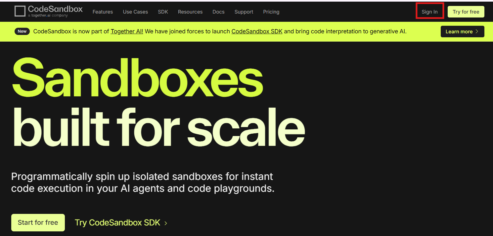
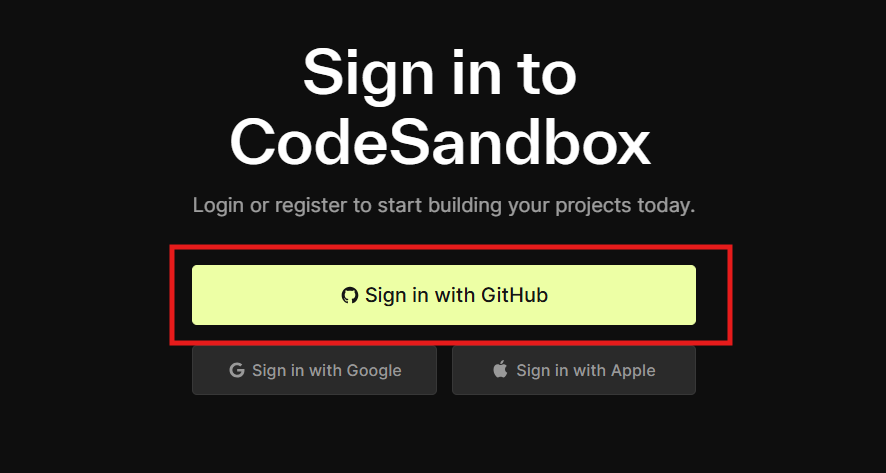

# React タスク管理アプリケーション チュートリアル

このチュートリアルでは、Reactを使用してタスク管理アプリケーションを作成する方法を学びます。このアプリケーションでは、タスクの追加、削除、完了状態の切り替え、フィルタリングなどの基本的な機能を実装します。

# 準備

## 1. Githubアカウントの作成（アカウント所持していない方向け）
以下を参考に
https://zenn.dev/keison8864/articles/069d9be35b92c2

## 2. CodeSandboxの利用
以下にアクセスする。

https://codesandbox.io/

「Sign in」をクリック

先ほど作成したGithubアカウントを利用してログインする

