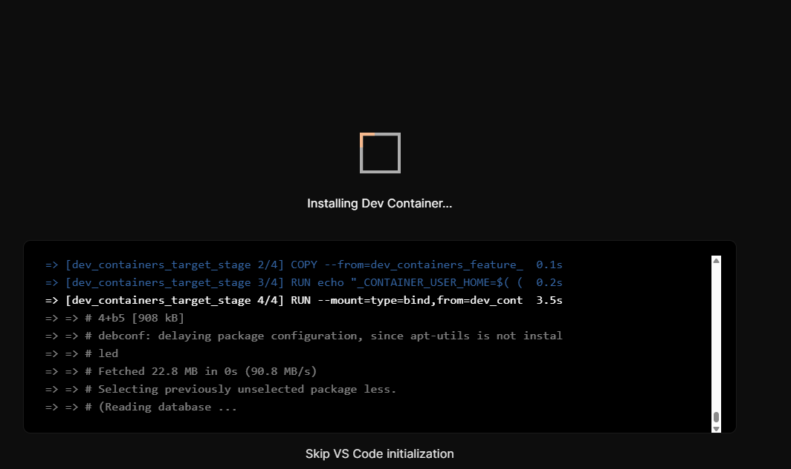

# プロジェクトのセットアップと基本的なコンポーネントの作成

## 1. プロジェクトのセットアップ

### 1.1 プロジェクトの作成

以下の手順で新しいReactプロジェクトを作成します：

1. createを押下


2. Reactを選択します。


3. Nameを入力し、Create Sandboxを押下する。


### 1.2 Tailwind CSSのセットアップ

Tailwind CSSを利用できるように設定します：

/public/index.htmlに以下を追記します。
```html
<link href="https://cdn.jsdelivr.net/npm/tailwindcss@2.2.19/dist/tailwind.min.css"
rel="stylesheet"
/>
```


### 1.3 利用するライブラリのセットアップ
- axios
  - 

- dotenv
  - 

## 2. 基本的なコンポーネントの作成

### 2.1 ディレクトリ構造の作成

以下のディレクトリ構造を作成します：

```
src/
  ├── components/
  │   ├── TaskForm.jsx
  │   ├── TaskList.jsx
  │   ├── TaskItem.jsx
  │   ├── TaskFilters.jsx
  │   └── TaskHelper.jsx
  ├── hooks/
  │   └── useTaskManager.js
  │   └── useAiTask.jsx
  ├── App.jsx
  └── index.js
```

### 2.2 各コンポーネントの基本実装

#### TaskForm.jsx
##### まずは`src/App.jsx`を編集します。

```jsx
import React from "react";
import { useTaskManager } from "./hooks/useTaskManager";
import TaskForm from "./components/TaskForm";

const App = () => {
  const { addTask } = useTaskManager();
  return (
    <div className="flex flex-col items-center p-4 max-w-2xl mx-auto bg-white rounded-lg shadow">
      <h1 className="text-2xl font-bold mb-4">タスク管理アプリ</h1>
      <TaskForm onAddTask={addTask} />
    </div>
  );
};

export default App;

```

`src/hooks/useTaskManager.js`の編集をします。

```javascript
import { useState, useEffect } from "react";

export const useTaskManager = () => {
  const [tasks, setTasks] = useState(() => {
    const savedTasks = localStorage.getItem("tasks");
    return savedTasks ? JSON.parse(savedTasks) : [];
  });

  useEffect(() => {
    localStorage.setItem("tasks", JSON.stringify(tasks));
  }, [tasks]);

  const addTask = (title, description = "", dueDate = "") => {
    if (!title.trim()) return;

    const newTask = {
      id: Date.now(),
      title,
      description,
      dueDate,
      completed: false,
    };

    setTasks([...tasks, newTask]);
  };

  return { addTask };
};

```


##### 基本的な機能
- useTaskManagerフックは次のことができます：
- タスクのリストを管理する
- ローカルストレージにタスクを保存する
- 新しいタスクを追加する

##### コードの詳細説明
インポート部分

```javascript
import { useState, useEffect } from "react";
```

- useState: データを保存・更新するためのReactフック
- useEffect: 副作用（画面更新以外の処理）を扱うためのReactフック

フックの定義
```javascript
export const useTaskManager = () => {
  // ここに中身が入ります
};
```
このようにuseで始まる関数がカスタムフックです。これを使うと、コードを再利用しやすくなります。


タスク状態の初期化

```javascript
const [tasks, setTasks] = useState(() => {
  const savedTasks = localStorage.getItem("tasks");
  return savedTasks ? JSON.parse(savedTasks) : [];
});
```
ここでは：

useStateの中で関数を使っています（これを「遅延初期化」と言います）
ブラウザのlocalStorageからタスク情報を取得しています
もし保存されたタスクがあれば、それをJSON.parseで通常のオブジェクトに変換
なければ空の配列[]を初期値とします

自動保存の設定
```javascript
useEffect(() => {
  localStorage.setItem("tasks", JSON.stringify(tasks));
}, [tasks]);
```

ここでは：

useEffectを使って「副作用」を実行しています
tasksが変わるたびに実行されます（[tasks]の部分がそれを指定しています）
タスク配列を文字列に変換して(JSON.stringify)ローカルストレージに保存しています

タスク追加関数

```javascript
const addTask = (title, description = "", dueDate = "") => {
  if (!title.trim()) return; 

  const newTask = {
    id: Date.now(), 
    title,          
    description,     
    dueDate,         
    completed: false, 
  };

  setTasks([...tasks, newTask]); 
};
```

ここでは：

タスクを追加する関数を定義しています
必須なのはtitleだけで、他のパラメータはオプションです
タイトルが空白だけの場合は早期リターンで処理終了
新しいタスクオブジェクトを作成
setTasksで状態を更新（[...tasks, newTask]は既存の配列にnewTaskを追加する構文）


`src/App.jsx`で呼び出す`src/components/TaskForm`コンポーネントを作成します。


```jsx
import React, { useState } from "react";

const TaskForm = ({ onAddTask }) => {
  const [newTaskTitle, setNewTaskTitle] = useState("");
  const [description, setDescription] = useState("");
  const [dueDate, setDueDate] = useState("");

  const handleSubmit = (e) => {
    e.preventDefault();
    if (!newTaskTitle.trim() || !description.trim() || !dueDate) {
      return;
    }
    onAddTask(newTaskTitle, description, dueDate);
    setNewTaskTitle("");
    setDescription("");
    setDueDate("");
  };

  return (
    <form onSubmit={handleSubmit} className="w-full mb-6">
      <div className="flex mb-2">
        <input
          type="text"
          value={newTaskTitle}
          onChange={(e) => setNewTaskTitle(e.target.value)}
          placeholder="タスクのタイトルを入力..."
          className="flex-grow p-2 border border-gray-300 rounded-l focus:outline-none"
          required
        />
        <div className="p-2 border border-gray-300 rounded-l focus:outline-none">
          期限
        </div>
        <input
          type="date"
          value={dueDate}
          onChange={(e) => setDueDate(e.target.value)}
          className="p-2 border border-gray-300 focus:outline-none"
          required
        />
        <button
          type="submit"
          className="bg-blue-500 text-white px-4 py-2 rounded-r hover:bg-blue-600"
        >
          追加
        </button>
      </div>
      <textarea
        value={description}
        onChange={(e) => setDescription(e.target.value)}
        placeholder="タスクの詳細を入力..."
        className="w-full p-2 border border-gray-300 rounded focus:outline-none"
        rows="2"
        required
      />
    </form>
  );
};

export default TaskForm;
```


このフォームコンポーネントでは：

- タスクのタイトル入力欄
- タスクの詳細（説明）入力欄
- 期限日の選択欄
- 追加ボタン

を提供しています。


コンポーネントの定義

```jsx
const TaskForm = ({ onAddTask }) => {
  // 中身はこの後に続きます
};
```

TaskFormは関数コンポーネントです

{ onAddTask }は、親コンポーネントから渡される関数（props）です

このコンポーネントで新しいタスクを追加するときに呼び出す関数です


状態（state）の管理

```jsx
const [newTaskTitle, setNewTaskTitle] = useState("");
const [description, setDescription] = useState("");
const [dueDate, setDueDate] = useState("");
ここでは3つの状態を管理しています：

newTaskTitle: タスクのタイトル（初期値は空文字）
description: タスクの詳細説明（初期値は空文字）
dueDate: タスクの期限日（初期値は空文字）
```

それぞれに対応する更新関数（setNewTaskTitleなど）も用意されています。

フォーム送信処理
```jsx
const handleSubmit = (e) => {
  e.preventDefault();
  if (!newTaskTitle.trim() || !description.trim() || !dueDate) {
    return;
  }
  onAddTask(newTaskTitle, description, dueDate);
  setNewTaskTitle("");
  setDescription("");
  setDueDate("");
};
```

ここでは：

- 入力チェック: タイトルか説明が空白だけ、または期限日が未設定の場合は何もせず処理を終了
- onAddTask: 親から受け取った関数を呼び出して、新しいタスクを追加
- 各フィールドをリセット: 入力欄を空にして次の入力に備える


##### 画面確認
ここまで実装できたら、実装した画面を確認してみましょう。
タスク登録フォームが表示されていればOKです！試しにタスクを追加してみてください。


#### TaskList.jsx
TaskListコンポーネントを追加し、`src/App.jsx`を更新します。

```jsx
import React from "react";
import { useTaskManager } from "./hooks/useTaskManager";
import TaskForm from "./components/TaskForm";
import TaskList from "./components/TaskList"; // 追加

const App = () => {
  // tasks, updateTask, deleteTask, toggleCompleteの追加
  const { addTask, tasks, updateTask, deleteTask, toggleComplete } = useTaskManager();
  return (
    <div className="flex flex-col items-center p-4 max-w-2xl mx-auto bg-white rounded-lg shadow">
      <h1 className="text-2xl font-bold mb-4">タスク管理アプリ</h1>
      <TaskForm onAddTask={addTask} />
      {/* TaskListの追加 */}
      <TaskList
        tasks={tasks}
        onToggleComplete={toggleComplete}
        onDelete={deleteTask}
        onUpdate={updateTask}
      />
    </div>
  );
};

export default App;

```


`src/hooks/useTaskManager.js`の編集をします。
```javascript
import { useState, useEffect } from "react";

export const useTaskManager = () => {
  const [tasks, setTasks] = useState(() => {
    const savedTasks = localStorage.getItem("tasks");
    return savedTasks ? JSON.parse(savedTasks) : [];
  });

  useEffect(() => {
    localStorage.setItem("tasks", JSON.stringify(tasks));
  }, [tasks]);

  const addTask = (title, description = "", dueDate = "") => {
    if (!title.trim()) return;

    const newTask = {
      id: Date.now(),
      title,
      description,
      dueDate,
      completed: false,
    };

    setTasks([...tasks, newTask]);
  };

  // ------------追加ここから-----------------
  const updateTask = (id, updates) => {
    setTasks(
      tasks.map((task) => (task.id === id ? { ...task, ...updates } : task))
    );
  };

  const deleteTask = (id) => {
    setTasks(tasks.filter((task) => task.id !== id));
  };

  const toggleComplete = (id) => {
    setTasks(
      tasks.map((task) =>
        task.id === id ? { ...task, completed: !task.completed } : task
      )
    );
  };
  // ------------追加ここまで-----------------

  return { 
    addTask,
    // tasks,deleteTask,toggleComplete,updateTaskの追加
    tasks,
    deleteTask,
    toggleComplete,
    updateTask, 
  };
};

```

##### 追加したコードの説明
1. updateTask関数 - タスク更新機能
```javascript
const updateTask = (id, updates) => {
  setTasks(
    tasks.map((task) => (task.id === id ? { ...task, ...updates } : task))
  );
};
```

##### 機能
- 特定のタスクの内容（タイトル、説明、期限など）を更新します。

##### 詳しい解説
- id: 更新したいタスクのID
- updates: 変更したい情報を含むオブジェクト（例: { title: "新しいタイトル" }）
- tasks.map(): 全タスクの配列を1つずつ処理します
- 三項演算子 ? : を使って：
  - もし現在のタスクIDが更新対象のIDと一致したら → そのタスクを更新
  - 一致しなければ → そのタスクをそのまま返す
- { ...task, ...updates }: スプレッド構文で既存のタスク情報を展開し、その上に更新情報を上書きします


具体例
```javascript
// ID=123のタスクのタイトルと説明を更新
updateTask(123, { title: "買い物リスト修正", description: "野菜も買う" });
```

#### 2. deleteTask関数 - タスク削除機能
```javascript
const deleteTask = (id) => {
  setTasks(tasks.filter((task) => task.id !== id));
};
```

##### 機能
- 特定のIDのタスクを削除します。

##### 詳しい解説
- id: 削除したいタスクのID
- tasks.filter(): 条件に合うタスクだけを残して新しい配列を作ります
- task.id !== id: 「タスクのIDが削除対象のIDと異なる」という条件
  - この条件に合うタスクだけが残り、指定したIDのタスクは除外されます
  - これによって、指定したIDのタスクを含まない新しい配列が作られ、それが新しい状態になります

#### 3. toggleComplete関数 - 完了状態切り替え機能
```javascript
const toggleComplete = (id) => {
  setTasks(
    tasks.map((task) =>
      task.id === id ? { ...task, completed: !task.completed } : task
    )
  );
};
```

##### 機能
- タスクの完了状態（完了/未完了）を切り替えます。

##### 詳しい解説
- id: 状態を切り替えたいタスクのID
- tasks.map(): 全タスクの配列を1つずつ処理します
- 三項演算子 ? : を使って：
  - もし現在のタスクIDが対象のIDと一致したら → 完了状態を反転
  - 一致しなければ → そのタスクをそのまま返す
- { ...task, completed: !task.completed }:
  - ...task: 既存のタスク情報を全て展開
  - completed: !task.completed: 完了状態を反転（trueならfalseに、falseならtrueに）


`src/components/TaskList.jsx`を編集します。
```jsx
import React from "react";
import TaskItem from "./TaskItem";

const TaskList = ({ tasks, onToggleComplete, onDelete, onUpdate }) => {
  return (
    <ul className="w-full">
      {tasks.length === 0 ? (
        <li className="p-4 text-center text-gray-500">タスクがありません</li>
      ) : (
        tasks.map((task) => (
          <TaskItem
            key={task.id}
            task={task}
            onToggleComplete={onToggleComplete}
            onDelete={onDelete}
            onUpdate={onUpdate}
          />
        ))
      )}
    </ul>
  );
};

export default TaskList;
```

#### 基本的な機能

TaskListコンポーネントの主な機能は：
- 複数のタスクを一覧表示する
- タスクがない場合に適切なメッセージを表示する
- 各タスクをTaskItemコンポーネントに渡して表示する

#### コンポーネントの定義
```jsx
const TaskList = ({ tasks, onToggleComplete, onDelete, onUpdate }) => {
  // 中身はこの後に続きます
};
```

このコンポーネントは4つのprops（プロパティ）を受け取ります：
- tasks: タスクの配列（一覧表示するデータ）
- onToggleComplete: タスクの完了状態を切り替える関数
- onDelete: タスクを削除する関数
- onUpdate: タスクを更新する関数

#### 条件付きレンダリング
```jsx
{tasks.length === 0 ? (
  <li className="p-4 text-center text-gray-500">タスクがありません</li>
) : (
  tasks.map((task) => (
    <TaskItem
      key={task.id}
      task={task}
      onToggleComplete={onToggleComplete}
      onDelete={onDelete}
      onUpdate={onUpdate}
    />
  ))
)}
```

ここでは三項演算子（条件 ? 真の場合 : 偽の場合）を使って：
- もしタスクの配列が空（長さが0）の場合：
  - 「タスクがありません」というメッセージを表示
  - text-gray-500でテキストを灰色に
  - text-centerでテキストを中央寄せに
- タスクが1つ以上ある場合：
  - tasks.map()でタスクの配列を繰り返し処理
  - 各タスクに対してTaskItemコンポーネントを表示
  - 必要なpropsを子コンポーネントに渡す

#### TaskItemへのprops受け渡し
```jsx
<TaskItem
  key={task.id}
  task={task}
  onToggleComplete={onToggleComplete}
  onDelete={onDelete}
  onUpdate={onUpdate}
/>
```

- key={task.id}: Reactのリスト表示で必要な一意のキー（パフォーマンス最適化のため）
- task={task}: 現在処理中のタスクオブジェクトを渡す
- 残りの3つのprops: 親から受け取った関数をそのまま子コンポーネントに渡す

このコンポーネントは「コンテナ」的な役割を果たし、実際のタスク表示や操作は子コンポーネントであるTaskItemに委ねています。これは「単一責任の原則」に基づいています。

#### 画面操作
ここまでできたら画面を操作してみましょう。
- 先ほど追加したタスクが表示されるか
  - 
- もう1件タスク追加
  - 
- タスクの更新
  - 編集ボタンを押下し、タスクタイトル、タスク詳細を更新する
  - 
  - 編集後、保存ボタンを押下し内容が更新されていることを確認する
- タスクの完了
  - チェックボックスをクリックして完了に更新する。
  - 
- タスクの削除
  - 先ほど更新したタスクの削除ボタンを押下し、タスクを削除する
  - 
  - タスクが1件になっていることを確認する。

#### TaskFilters.jsx

`src/App.jsx`を更新します。

```jsx
import React from "react";
import { useTaskManager } from "./hooks/useTaskManager";
import TaskForm from "./components/TaskForm";
import TaskList from "./components/TaskList";
import TaskFilters from "./components/TaskFilters"; // 追加

const App = () => {
  const {
    tasks,
    addTask,
    deleteTask,
    toggleComplete,
    updateTask,
      // filteredTasks,filter,setFilter,markAll,clearCompletedの追加
    filteredTasks,
    filter,
    setFilter,
    markAll,
    clearCompleted,
  } = useTaskManager();

  return (
    <div className="flex flex-col items-center p-4 max-w-2xl mx-auto bg-white rounded-lg shadow">
      <h1 className="text-2xl font-bold mb-4">タスク管理アプリ</h1>
      <TaskForm onAddTask={addTask} />
      {/* ---------TaskFiltersの追加ここから----------- */}
      <TaskFilters
        filter={filter}
        setFilter={setFilter}
        markAll={markAll}
        clearCompleted={clearCompleted}
      />
      <div className="w-full mt-4 text-sm text-gray-500">
        全タスク: {tasks.length} | 完了済み:{" "}
        {tasks.filter((t) => t.completed).length} | 未完了:{" "}
        {tasks.filter((t) => !t.completed).length}
      </div>
      {/* ---------TaskFiltersの追加ここまで----------- */}
      <TaskList
        tasks={filteredTasks} // ここをフィルター結果を表示できるように更新！！！
        onToggleComplete={toggleComplete}
        onDelete={deleteTask}
        onUpdate={updateTask}
      />

    </div>
  );
};

export default App;

```


`src/hooks/useTaskManager.js`の編集をします。
```javascript
import { useState, useEffect } from "react";

export const useTaskManager = () => {
  const [tasks, setTasks] = useState(() => {
    const savedTasks = localStorage.getItem("tasks");
    return savedTasks ? JSON.parse(savedTasks) : [];
  });

  const [filter, setFilter] = useState("all"); // filterの追加


  useEffect(() => {
    localStorage.setItem("tasks", JSON.stringify(tasks));
  }, [tasks]);

  const addTask = (title, description = "", dueDate = "") => {
    if (!title.trim()) return;

    const newTask = {
      id: Date.now(),
      title,
      description,
      dueDate,
      completed: false,
    };

    setTasks([...tasks, newTask]);
  };

  const updateTask = (id, updates) => {
    setTasks(
      tasks.map((task) => (task.id === id ? { ...task, ...updates } : task))
    );
  };

  const deleteTask = (id) => {
    setTasks(tasks.filter((task) => task.id !== id));
  };

  const toggleComplete = (id) => {
    setTasks(
      tasks.map((task) =>
        task.id === id ? { ...task, completed: !task.completed } : task
      )
    );
  };

  // ---------------ここから追加--------------------
  const markAll = (completed) => {
    setTasks(tasks.map((task) => ({ ...task, completed })));
  };

  const clearCompleted = () => {
    setTasks(tasks.filter((task) => !task.completed));
  };

  const filteredTasks = tasks.filter((task) => {
    if (filter === "active") return !task.completed;
    if (filter === "completed") return task.completed;
    return true;
  });
  // ---------------ここまで追加--------------------

  return { 
    addTask,
    tasks,
    deleteTask,
    toggleComplete,
    updateTask, 
    // filteredTasks,filter,setFilter,markAll,clearCompletedの追加
    filteredTasks,
    filter,
    setFilter,
    markAll,
    clearCompleted,
  };
};

```

1. markAll関数 - 全タスクの状態を一括設定
```javascript
const markAll = (completed) => {
  setTasks(tasks.map((task) => ({ ...task, completed })));
};
```

#### 機能
- すべてのタスクの完了状態を一度に変更します（全部完了にする/全部未完了にするなど）。
#### 詳しい解説
- completed: 設定したい完了状態（trueまたはfalse）
- tasks.map(): タスク配列の全要素に対して処理を行う
- ({ ...task, completed }):
  - 各タスクのすべてのプロパティを維持しながら（...task）
  - completedプロパティだけを新しい値に更新

この関数を使うと、「すべて完了にする」や「すべて未完了にする」ボタンが実装できます


2. clearCompleted関数 - 完了済みタスクの一括削除
```javascript
const clearCompleted = () => {
  setTasks(tasks.filter((task) => !task.completed));
};
```
#### 機能
- 完了済み（completed = true）のタスクをすべて削除します。

#### 詳しい解説

- tasks.filter(): 条件に合うタスクだけを残して新しい配列を作る
- (task) => !task.completed:
  - 未完了のタスク（completedがfalseのもの）だけを残す条件
  - つまり、完了済みのタスクはすべて除外される

この関数は「完了したタスクをクリア」ボタンなどに使えます


3. filteredTasks - フィルター機能の実装
```javascript
const filteredTasks = tasks.filter((task) => {
  if (filter === "active") return !task.completed;
  if (filter === "completed") return task.completed;
  return true;
});
```

#### 機能
- タスク一覧を「すべて」「未完了のみ」「完了済みのみ」で絞り込みます。

#### 詳しい解説
- filterという状態変数（上部のuseStateで追加）に基づいてタスクをフィルタリング
  - 3つのフィルター条件：
    - "active": 未完了のタスクのみ表示 （!task.completedがtrueのもの）
    - "completed": 完了済みのタスクのみ表示 （task.completedがtrueのもの）
    - それ以外（"all"など）: すべてのタスクを表示 （条件なし）

結果はfilteredTasksとして返され、これをタスク一覧表示に使用します


`src/components/TaskFilters.jsx`コンポーネントを編集する。
```jsx
import React from "react";

const TaskFilters = ({ filter, setFilter, markAll, clearCompleted }) => {
  return (
    <div className="w-full mb-4 flex justify-between items-center">
      <div className="flex space-x-2">
        <button
          onClick={() => setFilter("all")}
          className={`px-3 py-1 rounded ${
            filter === "all" ? "bg-blue-500 text-white" : "bg-gray-200"
          }`}
          type="button"
        >
          全て
        </button>
        <button
          onClick={() => setFilter("active")}
          className={`px-3 py-1 rounded ${
            filter === "active" ? "bg-blue-500 text-white" : "bg-gray-200"
          }`}
          type="button"
        >
          未完了
        </button>
        <button
          onClick={() => setFilter("completed")}
          className={`px-3 py-1 rounded ${
            filter === "completed" ? "bg-blue-500 text-white" : "bg-gray-200"
          }`}
          type="button"
        >
          完了済み
        </button>
      </div>

      <div className="flex space-x-2">
        <button
          onClick={() => markAll(true)}
          className="px-3 py-1 bg-gray-200 rounded hover:bg-gray-300"
          type="button"
        >
          全て完了
        </button>
        <button
          onClick={() => markAll(false)}
          className="px-3 py-1 bg-gray-200 rounded hover:bg-gray-300"
          type="button"
        >
          全て未完了
        </button>
        <button
          onClick={clearCompleted}
          className="px-3 py-1 bg-red-100 rounded hover:bg-red-200 text-red-600"
          type="button"
        >
          完了を削除
        </button>
      </div>
    </div>
  );
};

export default TaskFilters;

```

ここまでできたら画面を操作してみましょう。
- まずタスクを何件か追加する
- そのうち何件かのタスクを完了にする
- フィルターの確認で、全て、未完了、完了済みのそれぞれで絞込みをする
- 全て完了、全て未完了ボタンを押下して、一括更新できるか確認する
- 完了のタスクを一括削除する


#### TaskHelper.jsx

`src/App.jsx`を更新します。

```jsx
import React from "react";
import { useTaskManager } from "./hooks/useTaskManager";
import TaskForm from "./components/TaskForm";
import TaskList from "./components/TaskList";
import TaskFilters from "./components/TaskFilters";
import AITaskHelper from "./components/TaskHelper"; // 追加

const App = () => {
  const {
    tasks,
    addTask,
    deleteTask,
    toggleComplete,
    updateTask,
    filteredTasks,
    filter,
    setFilter,
    markAll,
    clearCompleted,
  } = useTaskManager();

  return (
    <div className="flex flex-col items-center p-4 max-w-2xl mx-auto bg-white rounded-lg shadow">
      <h1 className="text-2xl font-bold mb-4">タスク管理アプリ</h1>
      <TaskForm onAddTask={addTask} />
      <TaskFilters
        filter={filter}
        setFilter={setFilter}
        markAll={markAll}
        clearCompleted={clearCompleted}
      />
      <div className="w-full mt-4 text-sm text-gray-500">
        全タスク: {tasks.length} | 完了済み:{" "}
        {tasks.filter((t) => t.completed).length} | 未完了:{" "}
        {tasks.filter((t) => !t.completed).length}
      </div>
      <TaskList
        tasks={filteredTasks}
        onToggleComplete={toggleComplete}
        onDelete={deleteTask}
        onUpdate={updateTask}
      />
      {/* ---------TaskFiltersの追加ここから----------- */}
      <AITaskHelper filteredTasks={filteredTasks} />
      {/* ---------TaskFiltersの追加ここまで----------- */}
    </div>
  );
};

export default App;

```

`src/hooks/useAiTask.ts`を追加
```javascript
import axios from "axios";

export const useAiTask = (setResult, setIsLoading) => {
  // Azure OpenAI APIを呼び出す関数
  const DescriptionTaskByAi = async (prompt, tasks) => {
    setIsLoading(true);

    try {
      const response = await axios.post(
        process.env.REACT_APP_AZURE_OPENAI_ENDPOINT,
        {
          messages: [
            { role: "system", content: "あなたはタスク管理の専門家です。" },
            {
              role: "user",
              content: `
                あなたはタスク管理マネージャーです。
                「# ユーザーの指示」に回答する際に「# タスク一覧」をもとに回答を生成してください。
                タスク一覧が持つ情報については以下の通りになります。
                # タスク情報
                - id: タスクのIDで、タスクごとに一意になる
                - title: タスクのタイトル
                - description: タスクの詳細説明
                - dueDate: タスクの期限日
                - completed: タスクの完了状況
                
                # タスク一覧
                - ${JSON.stringify(tasks)}

                # ユーザーの指示
                ${prompt}
            `,
            },
          ],
          max_tokens: 150,
          temperature: 0.7,
        },
        {
          headers: {
            "Content-Type": "application/json",
            "api-key": process.env.REACT_APP_AZURE_OPENAI_KEY,
          },
        }
      );

      setResult(response.data.choices[0].message.content);
    } catch (error) {
      console.error("Azure OpenAI API error:", error);
      setResult("エラーが発生しました。もう一度お試しください。");
    } finally {
      setIsLoading(false);
    }
  };

  return { DescriptionTaskByAi };
};

```

#### 基本的な機能
このフックは：

- Azure OpenAI APIに接続してAIの機能を活用
- ユーザーのタスク一覧をAIに送信して分析
- AIからのレスポンスを取得・表示する

#### コードの詳細説明
インポート部分
```javascript
import axios from "axios";
```

axios: HTTPリクエストを簡単に行うためのライブラリ（APIと通信するために使用）

フックの定義
```javascript
export const useAiTask = (setResult, setIsLoading) => {
  // 中身はこの後に続きます
};
```

このフックは2つのパラメータを受け取ります：

- setResult: AIからの応答結果を保存するための関数
- setIsLoading: ロード中の状態を管理するための関数

これらは呼び出し側のコンポーネントから渡されるset関数（useState関数から生成）です

#### AI処理関数
```javascript
const DescriptionTaskByAi = async (prompt, tasks) => {
  setIsLoading(true);

  try {
    // APIリクエスト部分（後で説明）
  } catch (error) {
    console.error("Azure OpenAI API error:", error);
    setResult("エラーが発生しました。もう一度お試しください。");
  } finally {
    setIsLoading(false);
  }
};

```

ここでは：

- async関数として定義（非同期処理を行うため）
- prompt: ユーザーからのAIへの指示
- tasks: 現在のタスク一覧
- setIsLoading(true): 処理開始時にローディング状態をON
- try-catch-finally構文：
  - try: APIリクエストを試みる
  - catch: エラーが発生した場合の処理
  - finally: 成功・失敗に関わらず最後に実行される処理（ロード状態をOFF）

#### APIリクエスト部分
```javascript
const response = await axios.post(
  process.env.REACT_APP_AZURE_OPENAI_ENDPOINT,
  {
    messages: [
      // 省略
    ],
    max_tokens: 150,
    temperature: 0.7,
  },
  {
    headers: {
      "Content-Type": "application/json",
      "api-key": process.env.REACT_APP_AZURE_OPENAI_KEY,
    },
  }
);

```
ここでは：

- axios.post: HTTP POSTリクエストを送信（データを送って結果を受け取る）
- 第1引数: APIのエンドポイント（URL）- 環境変数から取得
- 第2引数: 送信するデータ
  - messages: 会話形式でAIに指示を送る（OpenAIのChat形式）
    - systemロール: AIの基本設定（「タスク管理の専門家」として振る舞うよう指示）
    - userロール: ユーザーからの指示（タスク情報とプロンプト）
  - max_tokens: 応答の最大長（トークン数）
  - temperature: 応答の多様性（0.7はやや創造的な応答を生成）
- 第3引数: リクエストの設定
  - headers: HTTPヘッダー情報
    - APIキーなどの認証情報（環境変数から取得）

`src/components/AITaskHelper.jsx`の追加

```jsx
import React, { useState } from "react";
import { useAiTask } from "../hooks/useAiTask";

const AITaskHelper = ({ filteredTasks }) => {
  const [input, setInput] = useState("");
  const [result, setResult] = useState("");
  const [isLoading, setIsLoading] = useState(false);

  const { DescriptionTaskByAi } = useAiTask(setResult, setIsLoading);

  const handleSubmit = (e) => {
    e.preventDefault();
    if (!input.trim()) return;

    DescriptionTaskByAi(input, filteredTasks);
  };

  return (
    <div className="w-full p-4 border rounded shadow">
      <h2 className="text-xl font-bold mb-4">AIタスクヘルパー</h2>

      <form onSubmit={handleSubmit} className="mb-4">
        <div className="flex">
          <input
            type="text"
            value={input}
            onChange={(e) => setInput(e.target.value)}
            placeholder="タスクについて質問してください..."
            className="flex-grow p-2 border rounded-l"
          />
          <button
            type="submit"
            className="bg-blue-500 text-white px-4 py-2 rounded-r"
            disabled={isLoading}
          >
            {isLoading ? "処理中..." : "送信"}
          </button>
        </div>
      </form>
      <div className="mt-4 p-3 bg-gray-50 rounded">
        <h3 className="font-semibold mb-2">AIの提案:</h3>
        <p>{result}</p>
      </div>
    </div>
  );
};

export default AITaskHelper;

```
#### 基本的な機能
AITaskHelperコンポーネントの主な機能は：

- ユーザーがAIにタスクについて質問できる入力フォームを提供
- 入力内容をAIに送信して分析してもらう
- AIからの提案や回答を表示する

コンポーネントの定義
```jsx
const AITaskHelper = ({ filteredTasks }) => {
  // 中身はこの後に続きます
};
```
このコンポーネントは1つのpropを受け取ります：

- filteredTasks: 現在表示されているタスクのリスト（AIに分析させるデータ）

#### 状態（state）の管理
```jsx
const [input, setInput] = useState("");
const [result, setResult] = useState("");
const [isLoading, setIsLoading] = useState(false);
```

3つの状態変数を使用しています：

- input: ユーザーが入力した質問やプロンプト
- result: AIからの応答結果
- isLoading: AIとの通信中かどうかを示すフラグ


#### フォーム部分の詳細
```jsx
<form onSubmit={handleSubmit} className="mb-4">
  <div className="flex">
    <input
      type="text"
      value={input}
      onChange={(e) => setInput(e.target.value)}
      placeholder="タスクについて質問してください..."
      className="flex-grow p-2 border rounded-l"
    />
    <button
      type="submit"
      className="bg-blue-500 text-white px-4 py-2 rounded-r"
      disabled={isLoading}
    >
      {isLoading ? "処理中..." : "送信"}
    </button>
  </div>
</form>
```

ここでは：
- テキスト入力欄：
  - value={input}: 現在の入力内容を表示
  - onChange: 入力が変更されるたびにsetInputで状態を更新
  - placeholder: 入力例を示すヒントテキスト
- 送信ボタン：
  - disabled={isLoading}: 処理中は押せないようにする
  - ボタンのテキストはロード中かどうかで変化（「処理中...」または「送信」）
  - 青い背景色と白いテキスト

#### 動作確認はのちほど、、、
Azure AI FoundryのAPIを呼び出すには環境変数で、エンドポイントやAPIキーを登録する必要があります。こちらについては後程設定しますので、動作確認は一旦スキップします。

## 2.3 プロジェクトをGithubで管理

コードの修正は以上となります。お疲れ様でした。

次は編集したコードをGithubで管理できるようにしたいのですが以下のような目的があります。
- 作成したコードをいつでも振り返れるように
- Githubでコード管理すると、CodeSandboxの「devbox」というプロジェクトを仮想マシンで動かすための環境を利用することができるようになります。
  - Azure AI Foundryを利用するうえでdevboxだと環境変数を安全に取り扱えることができるようになるためdevboxを今回は利用します。


では左側のメニューからGithubのアイコンをクリックしてください。

次にCreate repositoryを選択します。


リポジトリ名は自由に設定してください。

画像の赤枠で囲んだ部分のプライバシー設定は「Private」にしてください。


次はdevboxを利用するための設定を行います。

Create repositoryをした後は以下のような画面が自動で表示されます。
そのままNextを選択します。


Step2も何も変更せずにNextをクリック

Step3もいったん何も設定せずにNextを押下していただきますが、後ほど環境変数は設定します。

Step4 , Step5も何も変更せずにNextをクリック

Step6まできたら、Applyをクリックする。


では、プレビュー画面を表示してみましょう。
赤枠で囲んだメニューを選択し、Previewsのポート番号3000を選択する。


プレビュー画面に実装した画面が表示されればOKです。


## 2.4 環境変数の設定とAzure AI Foundryで作成したAPIの動作確認

Azure AI Foundryプロジェクトを作成（第3回のスライドで確認）

プロジェクトが完成したらチャットプレイグラウンドを開きます。

コードの表示メニューをクリックします。
開いたら、キー認証を選択してください。


下にスクロールするとエンドポイントとAPIキーが表示されています。


こちらをCodesandboxの方に環境変数として登録していきます。
`src/hooks/useAiTask.js`のコードの中で出現する環境変数は以下の2つです。
- REACT_APP_AZURE_OPENAI_ENDPOINT
- REACT_APP_AZURE_OPENAI_KEY


すると以下が表示されるので、先ほどAzure AI Foundryのチャットプレイグラウンドで見た環境変数を設定します。


設定ができたら、「Restart microVM」をクリックし、仮想環境を再起動します。

再起動が完了したらAzure AI FoundryのAPIが叩けるようになるので、動作確認してみましょう。

AIタスクヘルパーに以下のように入力してテストしてみましょう。


上記のようにAzure AI Foundryで作成したモデルをReact側から呼び出すことができました。

# 追加課題
- `useAiTask.js`で呼び出しているプロンプトを改善してみましょう。
  - 改善のポイント
    - 例や変数の追加
    - 出力形式の指定
    - ハルシネーション対策
    - temperatureやmax_tokensの調整
      などなど、、、
  - 改善のためのおすすめ手順
    - Azure AI Foundryのチャットプレイグラウンドで検証
    - サンプルコードを見て、それらを参考に`useAiTask.js`の実装に反映させる
