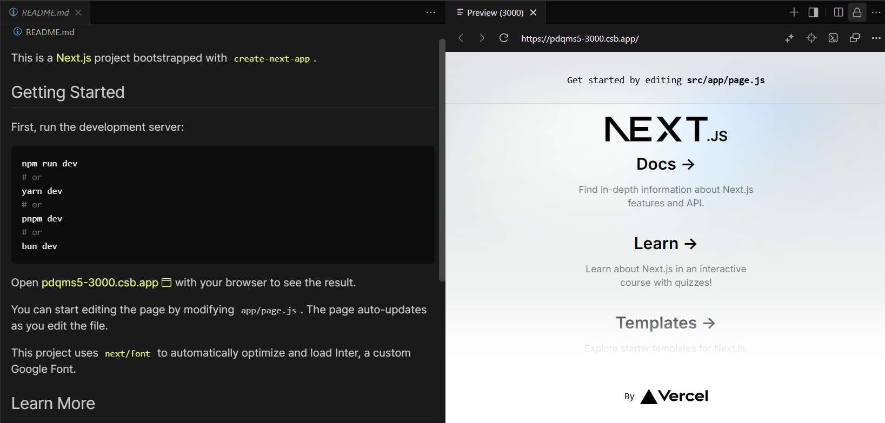

# プロジェクトのセットアップと基本的なコンポーネントの作成

## 1. プロジェクトのセットアップ

### 1.1 プロジェクトの作成

以下の手順で新しいReactプロジェクトを作成します：

1. createを押下


2. Reactを選択します。


3. Nameを入力し、Create Sandboxを押下する。


### 1.2 Tailwind CSSのセットアップ

Tailwind CSSを利用できるように設定します：

/public/index.htmlに以下を追記します。
```html
<link href="https://cdn.jsdelivr.net/npm/tailwindcss@2.2.19/dist/tailwind.min.css"
rel="stylesheet"
/>
```


### 1.3 利用するライブラリのセットアップ
- axios
  - 

- dotenv
  - 

## 2. 基本的なコンポーネントの作成

### 2.1 ディレクトリ構造の作成

以下のディレクトリ構造を作成します：

```
src/
  ├── components/
  │   ├── TaskForm.jsx
  │   ├── TaskList.jsx
  │   ├── TaskItem.jsx
  │   ├── TaskFilters.jsx
  │   └── TaskHelper.jsx
  ├── hooks/
  │   └── useTaskManager.js
  │   └── useAiTask.jsx
  ├── App.jsx
  └── index.js
```

### 2.2 各コンポーネントの基本実装

#### TaskForm.jsx
まずは`src/App.jsx`を編集します。

```jsx
import React from "react";
import { useTaskManager } from "./hooks/useTaskManager";
import TaskForm from "./components/TaskForm";

const App = () => {
  const { addTask } = useTaskManager();
  return (
    <div className="flex flex-col items-center p-4 max-w-2xl mx-auto bg-white rounded-lg shadow">
      <h1 className="text-2xl font-bold mb-4">タスク管理アプリ</h1>
      <TaskForm onAddTask={addTask} />
    </div>
  );
};

export default App;

```

`src/hooks/useTaskManager.js`の編集をします。
```javascript
import { useState, useEffect } from "react";

export const useTaskManager = () => {
  const [tasks, setTasks] = useState(() => {
    const savedTasks = localStorage.getItem("tasks");
    return savedTasks ? JSON.parse(savedTasks) : [];
  });

  useEffect(() => {
    localStorage.setItem("tasks", JSON.stringify(tasks));
  }, [tasks]);

  const addTask = (title, description = "", dueDate = "") => {
    if (!title.trim()) return;

    const newTask = {
      id: Date.now(),
      title,
      description,
      dueDate,
      completed: false,
    };

    setTasks([...tasks, newTask]);
  };

  return { addTask };
};

```


`src/App.jsx`で呼び出す`src/components/TaskForm`コンポーネントを作成します。

```jsx
import React, { useState } from "react";

const TaskForm = ({ onAddTask }) => {
  const [newTaskTitle, setNewTaskTitle] = useState("");
  const [description, setDescription] = useState("");
  const [dueDate, setDueDate] = useState("");

  const handleSubmit = (e) => {
    e.preventDefault();
    if (!newTaskTitle.trim() || !description.trim() || !dueDate) {
      return;
    }
    onAddTask(newTaskTitle, description, dueDate);
    setNewTaskTitle("");
    setDescription("");
    setDueDate("");
  };

  return (
    <form onSubmit={handleSubmit} className="w-full mb-6">
      <div className="flex mb-2">
        <input
          type="text"
          value={newTaskTitle}
          onChange={(e) => setNewTaskTitle(e.target.value)}
          placeholder="タスクのタイトルを入力..."
          className="flex-grow p-2 border border-gray-300 rounded-l focus:outline-none"
          required
        />
        <div className="p-2 border border-gray-300 rounded-l focus:outline-none">
          期限
        </div>
        <input
          type="date"
          value={dueDate}
          onChange={(e) => setDueDate(e.target.value)}
          className="p-2 border border-gray-300 focus:outline-none"
          required
        />
        <button
          type="submit"
          className="bg-blue-500 text-white px-4 py-2 rounded-r hover:bg-blue-600"
        >
          追加
        </button>
      </div>
      <textarea
        value={description}
        onChange={(e) => setDescription(e.target.value)}
        placeholder="タスクの詳細を入力..."
        className="w-full p-2 border border-gray-300 rounded focus:outline-none"
        rows="2"
        required
      />
    </form>
  );
};

export default TaskForm;
```

ここまで実装できたら、実装した画面を確認してみましょう。
タスク登録フォームが表示されていればOKです！試しにタスクを追加してみてください。


#### TaskList.jsx
TaskListコンポーネントを追加し、`src/App.jsx`を更新します。

```jsx
import React from "react";
import { useTaskManager } from "./hooks/useTaskManager";
import TaskForm from "./components/TaskForm";
import TaskList from "./components/TaskList"; // 追加

const App = () => {
  // tasks, updateTask, deleteTask, toggleCompleteの追加
  const { addTask, tasks, updateTask, deleteTask, toggleComplete } = useTaskManager();
  return (
    <div className="flex flex-col items-center p-4 max-w-2xl mx-auto bg-white rounded-lg shadow">
      <h1 className="text-2xl font-bold mb-4">タスク管理アプリ</h1>
      <TaskForm onAddTask={addTask} />
      {/* TaskListの追加 */}
      <TaskList
        tasks={tasks}
        onToggleComplete={toggleComplete}
        onDelete={deleteTask}
        onUpdate={updateTask}
      />
    </div>
  );
};

export default App;

```


`src/hooks/useTaskManager.js`の編集をします。
```javascript
import { useState, useEffect } from "react";

export const useTaskManager = () => {
  const [tasks, setTasks] = useState(() => {
    const savedTasks = localStorage.getItem("tasks");
    return savedTasks ? JSON.parse(savedTasks) : [];
  });

  useEffect(() => {
    localStorage.setItem("tasks", JSON.stringify(tasks));
  }, [tasks]);

  const addTask = (title, description = "", dueDate = "") => {
    if (!title.trim()) return;

    const newTask = {
      id: Date.now(),
      title,
      description,
      dueDate,
      completed: false,
    };

    setTasks([...tasks, newTask]);
  };

  // ------------追加ここから-----------------
  const updateTask = (id, updates) => {
    setTasks(
      tasks.map((task) => (task.id === id ? { ...task, ...updates } : task))
    );
  };

  const deleteTask = (id) => {
    setTasks(tasks.filter((task) => task.id !== id));
  };

  const toggleComplete = (id) => {
    setTasks(
      tasks.map((task) =>
        task.id === id ? { ...task, completed: !task.completed } : task
      )
    );
  };
  // ------------追加ここまで-----------------

  return { 
    addTask,
    // tasks,deleteTask,toggleComplete,updateTaskの追加
    tasks,
    deleteTask,
    toggleComplete,
    updateTask, 
  };
};

```

`src/components/TaskList.jsx`を編集します。
```jsx
import React from "react";
import TaskItem from "./TaskItem";

const TaskList = ({ tasks, onToggleComplete, onDelete, onUpdate }) => {
  return (
    <ul className="w-full">
      {tasks.length === 0 ? (
        <li className="p-4 text-center text-gray-500">タスクがありません</li>
      ) : (
        tasks.map((task) => (
          <TaskItem
            key={task.id}
            task={task}
            onToggleComplete={onToggleComplete}
            onDelete={onDelete}
            onUpdate={onUpdate}
          />
        ))
      )}
    </ul>
  );
};

export default TaskList;
```

ここまでできたら画面を操作してみましょう。
- 先ほど追加したタスクが表示されるか
- もう1件タスク追加
- タスクの更新
- タスクの完了
- タスクの削除

#### TaskFilters.jsx

```jsx
import React from "react";

const TaskFilters = ({ filter, setFilter, markAll, clearCompleted }) => {
  return (
    <div className="w-full mb-4 flex justify-between items-center">
      <div className="flex space-x-2">
        <button
          onClick={() => setFilter("all")}
          className={`px-3 py-1 rounded ${
            filter === "all" ? "bg-blue-500 text-white" : "bg-gray-200"
          }`}
          type="button"
        >
          全て
        </button>
        <button
          onClick={() => setFilter("active")}
          className={`px-3 py-1 rounded ${
            filter === "active" ? "bg-blue-500 text-white" : "bg-gray-200"
          }`}
          type="button"
        >
          未完了
        </button>
        <button
          onClick={() => setFilter("completed")}
          className={`px-3 py-1 rounded ${
            filter === "completed" ? "bg-blue-500 text-white" : "bg-gray-200"
          }`}
          type="button"
        >
          完了済み
        </button>
      </div>

      <div className="flex space-x-2">
        <button
          onClick={() => markAll(true)}
          className="px-3 py-1 bg-gray-200 rounded hover:bg-gray-300"
          type="button"
        >
          全て完了
        </button>
        <button
          onClick={() => markAll(false)}
          className="px-3 py-1 bg-gray-200 rounded hover:bg-gray-300"
          type="button"
        >
          全て未完了
        </button>
        <button
          onClick={clearCompleted}
          className="px-3 py-1 bg-red-100 rounded hover:bg-red-200 text-red-600"
          type="button"
        >
          完了を削除
        </button>
      </div>
    </div>
  );
};

export default TaskFilters;

```

#### TaskHelper.jsx

```jsx
import React, { useState } from "react";
import { useAiTask } from "../hooks/useAiTask";

const AITaskHelper = ({ filteredTasks }) => {
  const [input, setInput] = useState("");
  const [result, setResult] = useState("");
  const [isLoading, setIsLoading] = useState(false);

  const { DescriptionTaskByAi } = useAiTask(setResult, setIsLoading);

  const handleSubmit = (e) => {
    e.preventDefault();
    if (!input.trim()) return;

    DescriptionTaskByAi(input, filteredTasks);
  };

  return (
    <div className="w-full p-4 border rounded shadow">
      <h2 className="text-xl font-bold mb-4">AIタスクヘルパー</h2>

      <form onSubmit={handleSubmit} className="mb-4">
        <div className="flex">
          <input
            type="text"
            value={input}
            onChange={(e) => setInput(e.target.value)}
            placeholder="タスクについて質問してください..."
            className="flex-grow p-2 border rounded-l"
          />
          <button
            type="submit"
            className="bg-blue-500 text-white px-4 py-2 rounded-r"
            disabled={isLoading}
          >
            {isLoading ? "処理中..." : "送信"}
          </button>
        </div>
      </form>
      <div className="mt-4 p-3 bg-gray-50 rounded">
        <h3 className="font-semibold mb-2">AIの提案:</h3>
        <p>{result}</p>
      </div>
    </div>
  );
};

export default AITaskHelper;

```

### 2.3 App.jsxの更新

```jsx
import React from "react";
import { useTaskManager } from "./hooks/useTaskManager";
import TaskForm from "./components/TaskForm";
import TaskList from "./components/TaskList";
import TaskFilters from "./components/TaskFilters";
import AITaskHelper from "./components/TaskHelper";

const App = () => {
  const {
    tasks,
    filteredTasks,
    filter,
    setFilter,
    addTask,
    deleteTask,
    toggleComplete,
    updateTask,
    markAll,
    clearCompleted,
  } = useTaskManager();
  return (
    <div className="flex flex-col items-center p-4 max-w-2xl mx-auto bg-white rounded-lg shadow">
      <h1 className="text-2xl font-bold mb-4">タスク管理アプリ</h1>

      <TaskForm onAddTask={addTask} />
      <TaskFilters
        filter={filter}
        setFilter={setFilter}
        markAll={markAll}
        clearCompleted={clearCompleted}
      />
      <div className="w-full mt-4 text-sm text-gray-500">
        全タスク: {tasks.length} | 完了済み:{" "}
        {tasks.filter((t) => t.completed).length} | 未完了:{" "}
        {tasks.filter((t) => !t.completed).length}
      </div>
      <TaskList
        tasks={filteredTasks}
        onToggleComplete={toggleComplete}
        onDelete={deleteTask}
        onUpdate={updateTask}
      />

      <AITaskHelper filteredTasks={filteredTasks} />
    </div>
  );
};

export default App;

```

## 次のステップ

これで基本的なコンポーネントの作成が完了しました。次のステップでは、タスク管理の状態管理を実装します。`useTaskManager` カスタムフックを作成して、タスクの追加、削除、更新などの機能を実装していきます。 